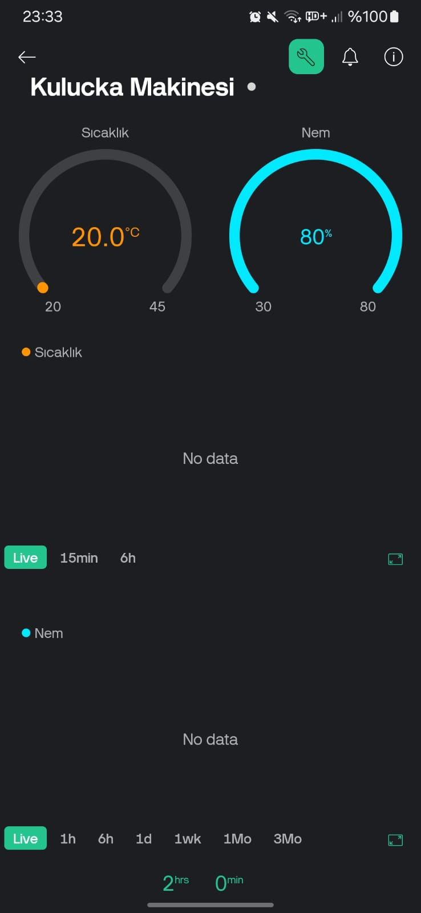

# 🐣 Smart Incubator Machine  

This project aims to create a **smart incubator** using ESP8266, DHT22 temperature and humidity sensor, Blynk IoT platform, and a servo motor. It optimizes the incubation process by automatically controlling temperature and humidity! 🥚🔥💨  

## Language Options 🌍
- [Türkçe (Readme)](readme.tr.md)
- [English (Readme)](readme.md)

## 📌 Features  
✅ **Wi-Fi connection via ESP8266**  
✅ **Temperature and humidity measurement with DHT22**  
✅ **Remote monitoring and control via Blynk integration**  
✅ **Automatic egg turning with servo motor**  
✅ **Heater and humidifier control with relay**  
✅ **System test mode for debugging**  

---

## 📦 Required Materials  
- 🖥️ **ESP8266** (e.g., NodeMCU)  
- 🌡️ **DHT22 temperature and humidity sensor**  
- 🔌 **Relay module** (for controlling heater and humidifier)  
- 🔄 **Servo motor** (for the egg turning mechanism)  
- 🔋 **Power supply** (for ESP8266 and other components)  
- 📱 **Blynk app** (for iOS/Android)  

📷 **Blynk Interface:**  
|  |
|--------|  
| 

  
| *Blynk Main Screen* |  

---

## 🔧 Connections  
| Component | ESP8266 Pin |  
|-----------|-------------|  
| DHT22     | D4          |  
| Relay (Heater) | D1      |  
| Relay (Humidifier) | D2  |  
| Servo Motor | D9       |  

---

## 🚀 Setup  

1️⃣ **Install Libraries** (for Arduino IDE):  
   - `ESP8266WiFi`  
   - `BlynkSimpleEsp8266`  
   - `DHT`  
   - `Servo`  

2️⃣ **Update the Arduino code**  
   - Update the `BLYNK_AUTH_TOKEN`, `SSID`, and `Wi-Fi password`.  

3️⃣ **Connect the Circuit** 🛠️  
   - Connect components according to the table above.  

4️⃣ **Upload the code to ESP8266** 📡  
   - Upload the code to ESP8266 via Arduino IDE.  

5️⃣ **Create virtual pins in the Blynk app** 📲  

📷 **Blynk Setup Screen:**  
|  |  |
|----------|----------|  
|  |  |  

6️⃣ **Run the system and check the temperature/humidity values.** 🔥💧  

---

## ⚙️ Working Principle  
- **Every 10 seconds**, temperature and humidity are measured.  
- **Every 180 minutes**, the servo motor turns the eggs.  
- **Heater and humidifier** are controlled based on temperature/humidity values.  
- **Blynk app** allows real-time tracking of values.  
- **System Test (DEBUG)** mode simulates the system.  

---

## 🛠️ Functions  
- `LoopControlTempHumidity()`: Reads sensor data and controls the relays.  
- `ControlRelay()`: Turns the relay on/off.  
- `ControlServo()`: Controls the servo motor.  
- `ReadSensor()`: Reads temperature and humidity data.  
- `BlynkSend()`: Sends data to the Blynk app.  
- `SystemTest()`: Simulates data for the debug mode.  

---

**Happy Incubating! 🐣🔥💨**  