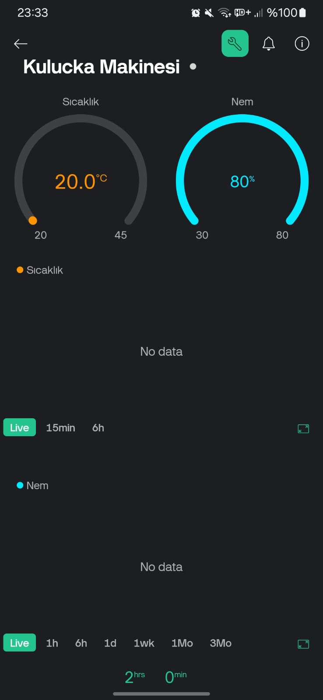
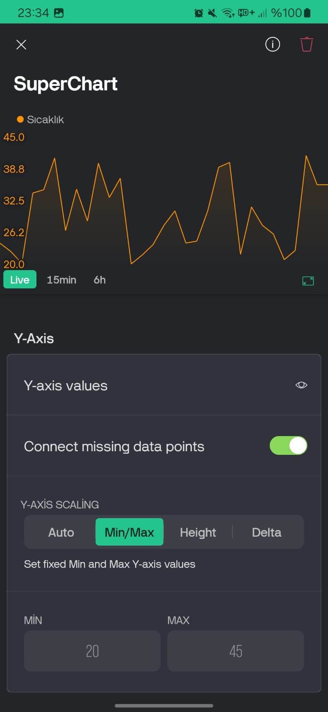
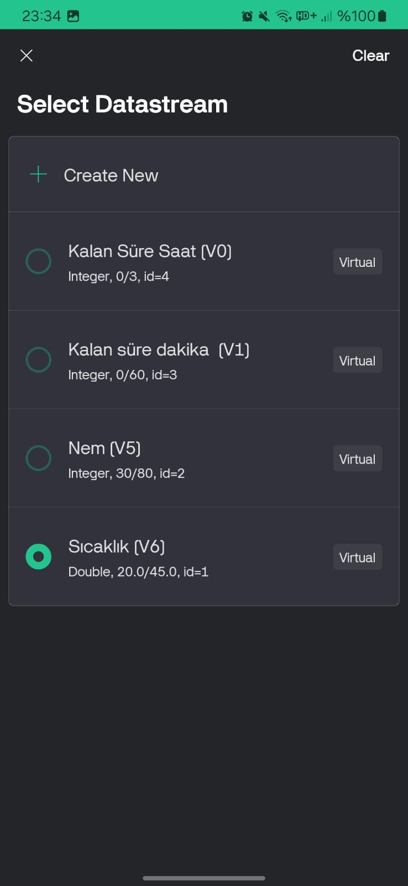

# 🐣 Akıllı Kuluçka Makinesi  

Bu proje, ESP8266, DHT22 sıcaklık ve nem sensörü, Blynk IoT platformu ve servo motor kullanarak bir **akıllı kuluçka makinesi** oluşturmayı amaçlar. Otomatik sıcaklık ve nem kontrolü yaparak kuluçka sürecini optimize eder! 🥚🔥💨  

## Dil Seçenekleri 🌍- [Türkçe (Readme)](readme.tr.md)
- [English (Readme)](readme.md)

## 📌 Özellikler  
✅ **ESP8266 ile Wi-Fi bağlantısı**  
✅ **DHT22 ile sıcaklık ve nem ölçümü**  
✅ **Blynk entegrasyonu ile uzaktan takip ve kontrol**  
✅ **Servo motor ile otomatik yumurta çevirme**  
✅ **Röle ile ısıtıcı ve nemlendirici kontrolü**  
✅ **Sistem testi için debug modu**  

---

## 📦 Gerekli Malzemeler  
- 🖥️ **ESP8266** (NodeMCU gibi)  
- 🌡️ **DHT22 sıcaklık ve nem sensörü**  
- 🔌 **Röle modülü** (ısıtıcı ve nemlendirici kontrolü için)  
- 🔄 **Servo motor** (yumurta çevirme mekanizması için)  
- 🔋 **Güç kaynağı** (ESP8266 ve diğer bileşenler için)  
- 📱 **Blynk uygulaması** (iOS/Android için)  

📷 **Blynk Arayüzü:**  
|  |
|--------|
| 

  
| *Blynk Ana Ekran* |

---

## 🔧 Bağlantılar  
| Bileşen | ESP8266 Pin |  
|---------|------------|  
| DHT22   | D4         |  
| Röle (Isıtıcı) | D1  |  
| Röle (Nemlendirici) | D2  |  
| Servo Motor | D9  |  

---

## 🚀 Kurulum  

1️⃣ **Kütüphaneleri yükleyin** (Arduino IDE için):  
   - `ESP8266WiFi`  
   - `BlynkSimpleEsp8266`  
   - `DHT`  
   - `Servo`  

2️⃣ **Arduino kodunu güncelleyin**  
   - `BLYNK_AUTH_TOKEN`, `SSID` ve `Wi-Fi şifrenizi` güncelleyin.  

3️⃣ **Devreyi bağlayın** 🛠️  
   - Yukarıdaki tabloya göre bileşenleri bağlayın.  

4️⃣ **Kodunuzu ESP8266'ya yükleyin!** 📡  
   - Arduino IDE üzerinden kodunuzu ESP8266'ya yükleyin.  

5️⃣ **Blynk uygulamasında sanal pinleri oluşturun.** 📲  

📷 **Blynk Kurulum Ekranı:**  
|  |  |
|----------|----------|
|  |  |

6️⃣ **Sistemi çalıştırın ve sıcaklık/nem değerlerini kontrol edin.** 🔥💧  

---

## ⚙️ Çalışma Mantığı  
- **Her 10 saniyede** bir sıcaklık ve nem ölçülür.  
- **180 dakikada bir** servo motor yumurtaları çevirir.  
- **Isıtıcı ve nemlendirici** sıcaklık/nem değerlerine göre açılıp kapanır.  
- **Blynk uygulaması** ile değerler anlık olarak takip edilir.  
- **Sistem Testi (DEBUG)** modu ile simülasyon yapılabilir.  

---

## 🛠️ Fonksiyonlar  
- `LoopControlTempHumidity()`: Sensör verilerini okur ve röleleri kontrol eder.  
- `ControlRelay()`: Röleyi açıp kapatır.  
- `ControlServo()`: Servo motoru kontrol eder.  
- `ReadSensor()`: Sıcaklık ve nem verilerini okur.  
- `BlynkSend()`: Verileri Blynk uygulamasına gönderir.  
- `SystemTest()`: Debug modu için değerleri artırır.  

---

**Mutlu Kuluçkalar! 🐣🔥💨**  

